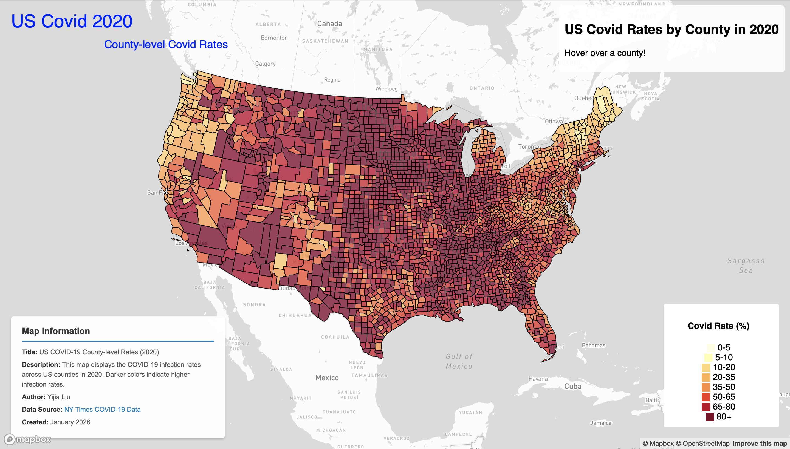
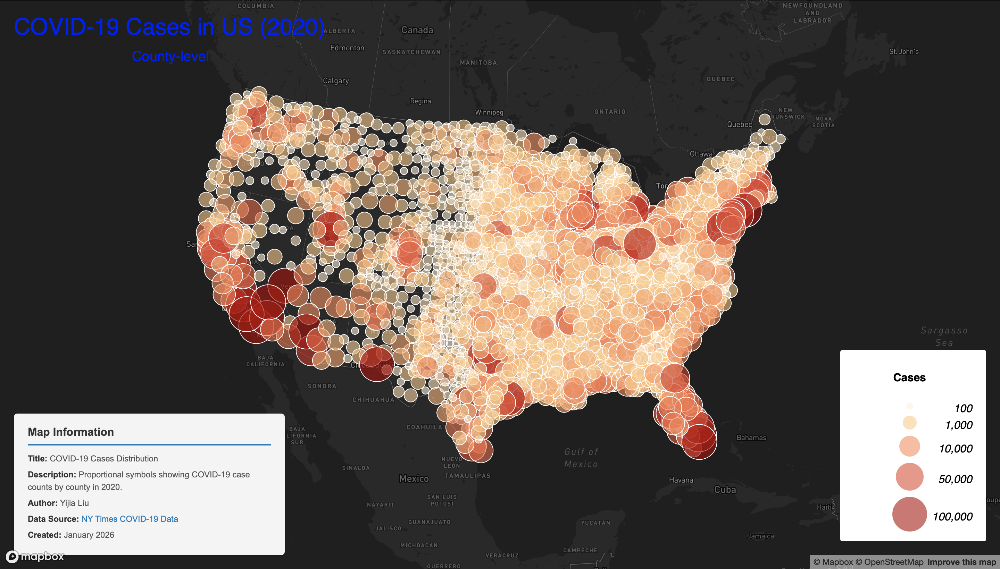

# The Map of COVID-19 Infections in 2020

---

## Project Overview
> This lab primarily focuses on the situation of COVID-19 cases in the United States in 2020.  The goal is to transform the data into more intuitive visual information through map visualization, thereby providing a systematic understanding of the distribution of cases. This project includes two maps: the first is a choropleth map showing the incidence rate of COVID-19, and the second is a proportional symbol map of COVID-19 cases. Both maps use counties as the spatial analysis unit, a fine-grained scale that effectively reflects geographical differences in the spread of the epidemic. 
---

## Interactive Map
- **Map 1: Choropleth Map of COVID-19 Incidence Rates (2020)**  
  An interactive choropleth map showing the incidence rate of COVID-19 by county in the United States in 2020.
  
  👉 [View Map 1](https://lily-liu61.github.io/Covid_Visualization/map1.html)

- **Map 2: Proportional Symbol Map of COVID-19 Cases (2020)**  
  An interactive proportional symbol map visualizing the total number of COVID-19 cases across U.S. counties in 2020.
  
  👉 [View Map 2](https://lily-liu61.github.io/Covid_Visualization/map2.html)
---

## Functions
### **Map 1**  
> This map primarily shows the COVID-19 infection rate in each county of the United States. The infection rate is represented visually by color, with lighter colors indicating lower infection rates and darker colors indicating higher infection rates. Because each county occupies a very small area, the map can be zoomed in to view specific administrative boundaries.
#### Highlighted Function
- This map allows you to view the name of the county and its corresponding COVID-19 infection rate by hovering your mouse over it. This information will be displayed in the upper right corner of the map. If the mouse is not hovering over a county, the information box in the upper right corner will display "Hover over a county!".

### **Map 2**  
> This map displays information on the number of COVID-19 cases in each county of the United States, using circular icons to represent the different quantities. This icon can be interpreted in two ways: firstly, by the color of the icon, with darker colors representing more cases; and secondly, by the size of the circle – if the colors are the same, a larger circle indicates more cases. Due to the large amount of data, many of the circular icons overlap, so you can zoom in to view the details.
#### Highlighted Function
- This map allows you to access information by clicking on the circular icons. When you randomly click on a circular icon, an information box will pop up above it, containing the county name and the recorded number of COVID-19 cases. The arrow of the information box points to the center of the clicked icon. This facilitates the presentation of detailed information without neglecting the overall visualization.

---

## Data Source

- **The New York Times**: COVID-19 case and death data for U.S. counties (2020).  
  [us-counties.csv](https://github.com/nytimes/covid-19-data/blob/43d32dde2f87bd4dafbb7d23f5d9e878124018b8/live/us-counties.csv)

---

## Credit
- Interactive maps powered by **Mapbox**.  
- Data processing and format conversion performed using **Mapshaper**.

---

<!-- 
如有开源协议可在此说明
-->
